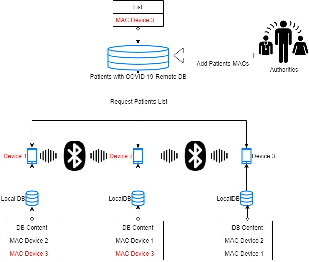

# Introduction 
The app monitors people in your vicinity who are identifiable by the Bluetooth connection of your mobile phone and stores the identification data of these devices. By pressing a button you can access the database in which the unique identifiers of the mobile phones are registered, to verify whether the persons with whom you came in contact have subsequently been confirmed with COVID-19. If you have identified a potential contact, please confer with the authorities whether that contact requires your inclusion among the monitored persons, or even testing for COVID-19.

Logical steps:
1.	Your phone memorizes all the phones that were near you in a local log
2.	Your phone downloads a list of phones belonging to infected patients
3.	Your phone searches if they were registered in your log history
4.	Result:
	-	No risk of exposure was identified
	-	You had a potential contact - contact the authorities

The application needs Bluetooth and Location permissions to enable monitoring. The verification and monitoring of the interaction history is done on your mobile terminal. The transmission of data to the server is done only in case of a potential risk of contracting the virus (not implemented).

# Concept
Monitoring the risk of contracting COVID-19 involves identifying the possibilities for infection defined as potential contact between a person confirmed with the infection and persons in his/hers immediate vicinity. With the widespread use of mobile phones, an obvious method is monitoring these instances through the integrated Bluetooth. Thus, when two Bluetooth devices detect each other, it means that both are in a circle with a radius of less than 10m between each other. Moreover, each phone is uniquely identified worldwide by the MAC address of its Bluetooth device.

CovTrack writes to a database a local log of all Bluetooth devices detected by the mobile phone, recording location, maximum contact time and the approximate distance from it. The log is kept only on the mobile phone and is not transmitted to third parties.

# Contribute
The source code of the application is available on GitHub - CovTrack project. It is a reference implementation of the concept developed by our team for Android mobile phones. Developing the application as soon as possible requires contributions from a wider community and all help is welcome.

A compiled version of the application can be found on the RISE web page at http://covid19.roinspace.com/index.php?download=APP. To install it, enter this address using an Android terminal and agree to download it. You may need to enter the URL by copying it, if the download does not start automatically.

When the download is complete, open the file and install it. You may need to enable the option of installing applications from unknown sources in your phone’s settings. The application is safe and was developed only for the purpose of monitoring the COVID-19 epidemic. The code is available to audit on GitHub.
